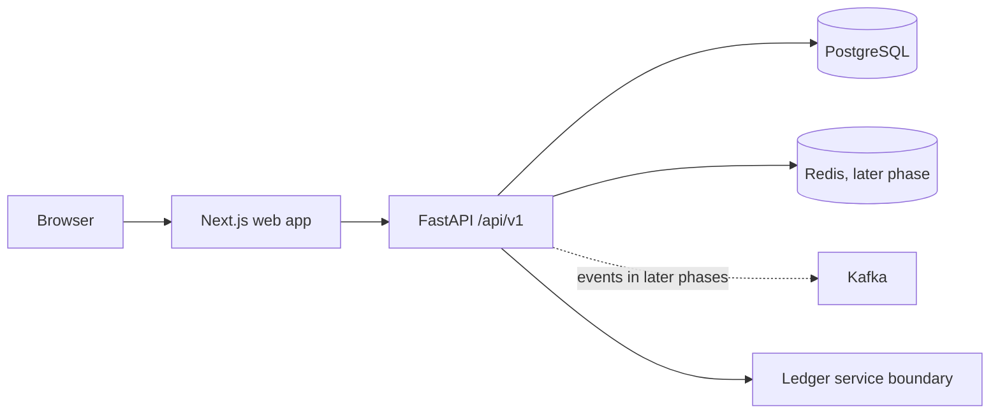

# Architecture

## Initial shape

Begin as a modular monolith: one web app, one API, and PostgreSQL. Keep module boundaries in folders and service interfaces. Add Redis, workers, event streaming, and separately deployed services when the phase requires them; this keeps local development understandable and avoids distributed transaction complexity early.

## Request path

1. Web route renders a feature page and uses a typed query/mutation hook.
2. API router authenticates, validates a Pydantic request schema, and enforces role/resource permissions.
3. Service applies the business rule and opens the required database transaction.
4. Repository performs focused SQLAlchemy queries. Financial posting later writes immutable journal entries atomically.
5. Response schema returns only fields the caller may see. Sensitive actions write an audit event.

## Folder conventions

Frontend feature folders own their screens, API hooks, schemas and feature components. `components/ui` contains generic design primitives only. Backend modules use `router.py`, `schemas.py`, `service.py`, `repository.py`, and `models.py` only where needed; do not create empty layers that add no behavior. Shared contracts should be generated from OpenAPI where practical.

## Security and money rules

- Backend permission checks and tenant/resource ownership checks protect every request.
- Store password hashes only; keep secrets outside source control.
- Store monetary values as PostgreSQL `NUMERIC` and Python `Decimal`.
- Financial posting must be atomic, idempotent, auditable, and balanced. Correct posted entries with reversals.
- Do not store raw CVV or log credentials, access tokens, full card numbers, or full identity data.
- Mock rates, decisions, OCR and screening must be labeled as simulated and must not imply regulated decisions.
